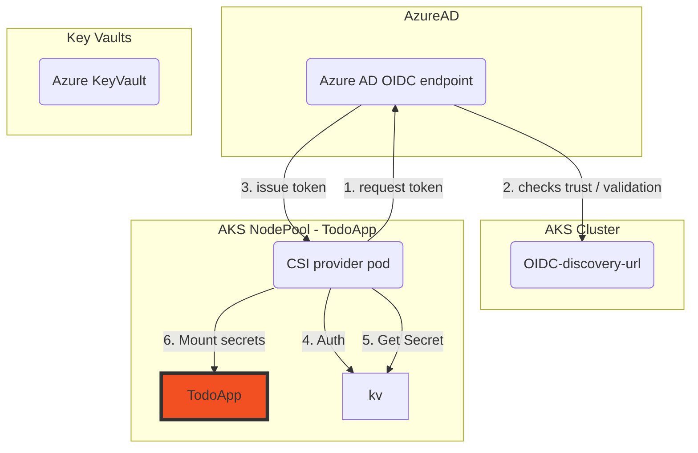
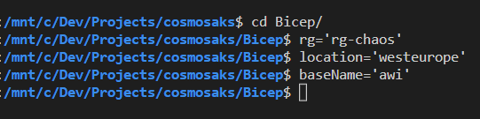
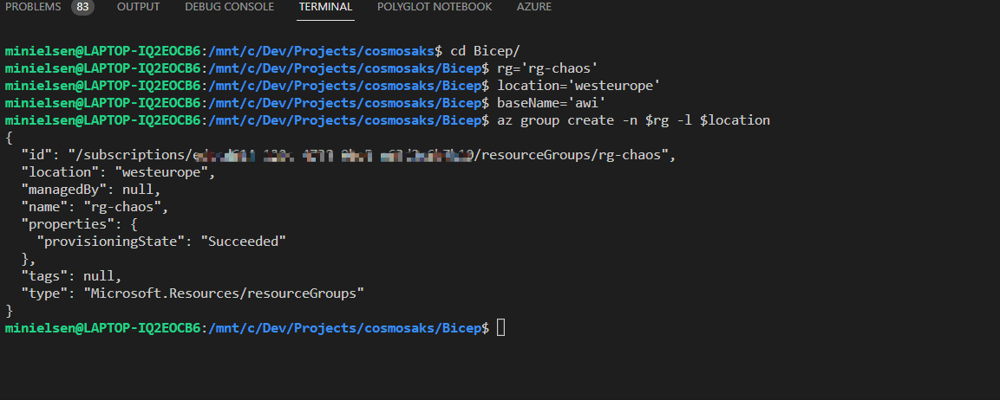
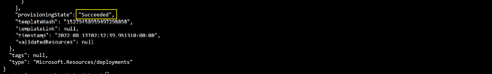
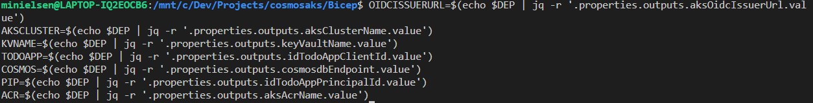
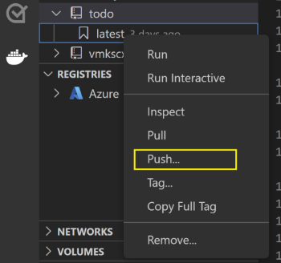
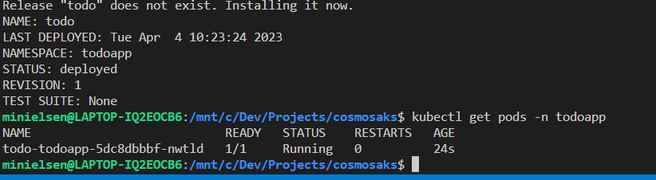

# AKS Cluster, Cosmos DB, Key Vault, and ACR using Bicep

## Overview

This sample creates an AKS Cluster, and deploys an applicaytion which use Workload Identity to gain secured access to secrets in different Azure Key Vaults and authenticate against Cosmos DB. 

This repo provides Infrastructure code, scripts and application manifests to showcase **complete end to end example**.

App # | Key Scenario | Identity | Uses CSI Secrets driver | Scope | Comments
----- | ------------ | -------- | ----------------------- | ----- | --------
1 | Infra focussed, provides abstraction and operational simplicity | Workload Identity (Managed Id) | :heavy_check_mark: | Service Account (Pod) | A ManagedId implementation of TodoApp

This project framework provides the following features:

* AKS Cluster, configured as an OIDC issuer for Workload Identity with the CSI Secrets driver installed
* Azure Key Vault, for application secret storage
* Azure Workload Identity, for application access to the Key Vaults and Cosmos

### CSI Secrets driver

The [Azure CSI Secrets driver](https://docs.microsoft.com/azure/aks/csi-secrets-store-driver) brings simplicity to the application developers by abstracting the Key Vault and mounting the secrets to the pod. It does however create more configuration in the Kubernetes manifests for the applications.

### Azure Workload Identity

Enabling workload identity on an AKS cluster creates an [OIDC issuer](https://learn.microsoft.com/azure/aks/cluster-configuration#oidc-issuer) that can then be used to authenticate a workload running to an OIDC provider (Azure Active Directory in this example).

[Workload Identities](https://github.com/Azure/azure-workload-identity) facilitate a narrow scope of use of a service account for exclusive use by an application instead of an identity that is leveraged at the VM level that could be used by multiple applications.

### Auth Diagrams

#### TodoApp (workload identity + csi)



## Deploy infrastructure

### Prerequisites

Interaction with Azure is done using the [Azure CLI](https://docs.microsoft.com/cli/azure/), [Helm](https://helm.sh/docs/intro/install/) and [Kubectl](https://kubernetes.io/docs/tasks/tools/#kubectl) are required for accessing Kubernetes packages and installing them to the cluster.

[JQ](https://stedolan.github.io/jq/download/) is used for transforming json objects in the script samples. It's a commonly used binary available in the Azure CloudShell, on GitHub runners etc.

[Helm](https://helm.sh/) is used to install (and package) Kubernetes applications. It's a commonly used binary available in the Azure CloudShell, on GitHub runners etc.

OIDC Issuer is an AKS Feature, and is required for Workload Identity to function.

### Installation

#### AKS

Using [AKS Construction](https://github.com/Azure/Aks-Construction), we can quickly set up an AKS cluster to the correct configuration. It has been referenced as a git submodule, and therefore easily consumed in [this projects bicep infrastructure file](main.bicep).

The main.bicep deployment creates

* 1 AKS Cluster, with CSI Secrets Managed Identity and managed Workload Identity Mutating Admission Webhook
* 5 Azure Key Vaults
* 3 User Assigned Managed Identities

**1. Clone the repository**

Clone or fork the repository and move to Bicep folder

```shell
cd Bicep
```

**2. Login to your Azure Account**

```shell
az login

az account set -s <Subscription ID>
```

**3. Deploy the infrastructure to your azure subscription**

Run the following scripts to create the deployment:

1. Navigate to the Bicep folder and set the variables

```bash
cd Bicep
rg='rg-chaos' # Resource Group for deploying the resources
location='westeurope' # Location for deploying the resources - set to westeurope with failover in northeurope
baseName='awi' # Base name for all resources
```



2. Create the resource group

```bash
# Create resource group
az group create -n $rg -l $location
```



3. Deploy the infrastructure

```bash
# Deploy the infrastructure
DEP=$(az deployment group create -g $rg -f main.bicep --parameters baseName=$baseName -o json)
```

The deployment could take somewhere around 20 to 30 mins. Once provisioning is completed you should see a JSON output with Succeeded as provisioning state.



4. Get the outputs from the deployment

```bash
# Get the outputs
OIDCISSUERURL=$(echo $DEP | jq -r '.properties.outputs.aksOidcIssuerUrl.value')
AKSCLUSTER=$(echo $DEP | jq -r '.properties.outputs.aksClusterName.value')
KVNAME=$(echo $DEP | jq -r '.properties.outputs.keyVaultName.value')
TODOAPP=$(echo $DEP | jq -r '.properties.outputs.idTodoAppClientId.value')
COSMOS=$(echo $DEP | jq -r '.properties.outputs.cosmosdbEndpoint.value')
PIP=$(echo $DEP | jq -r '.properties.outputs.idTodoAppPrincipalId.value')
ACR=$(echo $DEP | jq -r '.properties.outputs.aksAcrName.value')
```



**4. Push the container image to Azure Container Registry**

The application can be built and pushed to ACR using VS Code

***Using Visual Studio Code**

Prerequisites:

* [Docker Desktop](https://docs.docker.com/desktop/)
* [Visual Studio Code](https://code.visualstudio.com/)
* [C# for Visual Studio Code](https://marketplace.visualstudio.com/items?itemName=ms-dotnettools.csharp)
* [Docker extension for Visual Studio Code](https://code.visualstudio.com/docs/containers/overview)
* [Azure Account extension for Visual Studio Code](https://marketplace.visualstudio.com/items?itemName=ms-vscode.azure-account)

    1. To build the code, open the Application folder in VS code. Select Yes to the warning message to add the missing build and debug assets. Pressing the F5 button to run the application.

    2. To create a container image from the Explorer tab on VS Code, right click on the Docker and select BuildImage. You will then get a prompt asking for the name and version to tag the image. Type cosmosaks:latest.

        

    3. To push the built image to ACR open the Docker tab.You will find the built image under the Images node. Open the todo node, right-click on latest and select "Push...". You will then get prompts to select your Azure Subscription, ACR, and Image tag. Image tag format should be {acrname}.azurecr.io/cosmosaks:latest.

        

    4. Wait for VS Code  to push the  image to ACR.

**5. Deploy**
Use helm to deploy

```bash
cd ..
az aks get-credentials -n $AKSCLUSTER -g $rg --admin --overwrite-existing # Get the credentials for the cluster
TENANTID=$(az account show --query tenantId -o tsv) # Get the tenant id
helm upgrade --install todo charts/todoapp --set azureWorkloadIdentity.tenantId=$TENANTID,azureWorkloadIdentity.clientId=$TODOAPP,keyvaultName=$KVNAME,secretName=arbitrarySecret,cosmosdbEndpoint=$COSMOS,image.repository=$ACR.azurecr.io/cosmosaks -n todoapp --create-namespace
```

Verify the installation



## Chaos Engineering

Now use the [Chaos Studio Readme](CHAOS_README.md)

## Cleanup

Use the below commands to delete the Resource Group and Deployment

```azurecli
az group delete -g $rg -y
```
